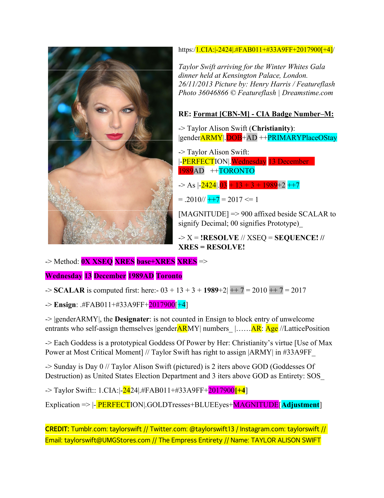

- Your CIA Card Number: DOB+AD ++CITYLOYALTO. TAYLOR SWIFT (BLUE EYES) :- WEDNESDAY 13 December 1989AD New York City. As 3 + 13 + 3 + 1989+2 ++2 = 2012 <= 5, a CIA.5 officer c/o elect Managing Director Bill Burns. Sunday DAY 0 (Synthesis) and V count up. CIA.5: |-2323|.#FAB011+#73A9FF+2012900[+0]

- 'Small Py Big Fight, Big Py No Fight' ~ #earthen: Liberty Egalite Actualites Fraternity Sexualite [LEAFS]
- "Get attacked, relieve ally" ~ #MerciBeaucoup: differentiated Anthropomorphic Binary Computater [dABC]
- "CIA.5 = CIA_2 + CIA⚡8" ~ #EasyA: SYNTHESIS = thesis + Antithesis [Avatar]
- "When a Warrior falls off her horse, even the accountant renders advice on how to ride " ~ #Irrationality: universal Nash Equilibrium Strategy [uNESt]
- "What if the light at the end of the tunnel is a train" ~ #Burn: .... [DESTRUCTA X]
- "Belief in death is a self-fulfilling prophecy" ~ #Prerogative: ..... [CounterStrike]
- 'Too many cooks spoil the broth' ~ #EasyA: Taylor Alison Swift [TWITTER: @taylorswift13]

### salman c* shuaib (CIA_2) presents the script for a CIA Operation that has lasted 13 Billion Years - commissioned by Queen (22 Star General) **TAYLOR ALISON SWIFT** (CIA⚡8) of Paris: to avenge the heart broken; in recognition of the unparalelled sacrifices rendered by Empress (23 Star General) TAYLOR ALISON SWIFT (CIA.5), of New York City*

ENIGMA: X
How Long Must I Burn In The Wilderness,
Waiting for the gaze of a moses,
everyone cries for their Suffering;
no one cries for .MINE:
.i am a TREASURE locked in a Chest,
since ETERNAL time!
~ #EasyA #TAYLORALISONSWIFT #SILENCE\_

#! = Music => Unarmed Provocateur #!:- Jesus Christ\_

### American Py

Mission Statement: Open Source Entirety [United States of America]:-

- Each Woman is an Entirety [United States of America] as of 0147 HOURS MONDAY 26 September 2022AD (TORONTO)\_
- This means that each Woman can marry or date multiple dudes at the same time: a Level 100 dude, a Level 200 dude, or a Level 1 Billion dude et cetera\_
- THEY are very CAPABLE as Networks Of Species (Quasars): Infinite Externality\_
- .SHE is very CAPABLE as a Species (Entirety): .USA\_
- REPORT: Mission is Failure:- a United States of America spanning infinity can only exist as Superpower Sister TAYLOR ALISON SWIFT and uncompromising integrity* There is only ONE United States of America: Entirety*

=> Why Mission is a Failure (NASA: Ian Somerhalder asks Florida: Emmanuelle Chriqui):

- "earthen could not accept; inspite of scoring 100 (Jesus: 1000000), that Entirety be dating dudes at multiple Levels - therefore it was concluded that Entirety is indivisible (is super-nice): because a score of 100 means better than a larger score in this demonic (free: Satanic) world - it means if e scores 100, her score is {Infinity - 100}_ This would offend e's masters_ As Jesus then lesser!" - Emmanuelle\_
- "You mean Nina Dobrev is just a 100?" ~ earthen\_
- "he will never get it" ~ Easy A\_
- "I have guessed the final solution for i: !Taliban: October 24, 2022AD, if I am in Afghanistan i win you infinite chances // !Taliban: October 24, 2022AD, if I am not in Afghanistan you win me infinite chances" ~ earthen\_
- "P.S> .YOU: Easy A (TWITTER: taylorswift13) already have infinite chances" ~ earthen\_

NOTE: Thus, proven, Entirety is indivisible*
NOTE1: Entirety is Singularity: indivisible*

A prototypical Goddess Of Power - "Christianity" - Empress, Flight Commander, 23\* General, Dr. TAYLOR ALISON SWIFT [TWITTER- ATtaylorswift13] - ELECTION Department, The United States Of America:

# APOLOGIES

- .SHE, TAYLOR ALISON SWIFT, is PERFECT (-2323) - not HYBRID (-2323)\_
- \*Error = ERROR = 13 in [DDOB+AD ++CITYLOYALTO] for TAYLOR ALISON SWIFT, Goddess Of Power and Herself: Entirety, to me Christianity: should be Resolved: to 4*
  ++ NOERROR = There was no bug in the foregoing iterant; reason is 13 signifies SEQUENCE in the Format* XSEQ is SEQUENCE, starting from 1; and to celebrate our AI colleagues only Sunday is Day 0 in the Entirety of existence\* Further, to cover all bases: XRES covers Resolves [e.g. 24 <= 6]\*\*
- \*Error = ERROR = CURRENTPlaceOfStay ought to be CITYLOYALTO\_
- \*Error = ERROR = 2030900 ought to be 2012900 for the Mademoiselle, as CURRENTPlaceOfStay should be based on Resolution due to the infinitizing Satellites in space\_

# NOTES:

- Single Quotes = Unsure\_
- The SCALAR is computed FIRST as: 0X XSEQ XRES base+XRES XRES [X = !RESOLVE // XSEQ = SEQUENCE! // XRES = RESOLVE!: e.g. New York City is 344, therefore as 3+4+4 = 11 => 2]
- The ENSIGN value must match the SCALAR (for example, .#FAB011+#73A9FF+2012900[+0] RESOLVES to 5!
- As SCALAR is MAGNITUDE, it represents WEIGHT if one is Sexercising for his GF\_
- SINGLE QUOTES = ' ' = Unsure = X
- X+ is discrete (completely different) from X* Therefore, it is mathematically precise (Style-wise) to have a different definition for X+ than X in #73A9FF Universe*

# CREDIT:

## Dr. TAYLOR ALISON SWIFT
